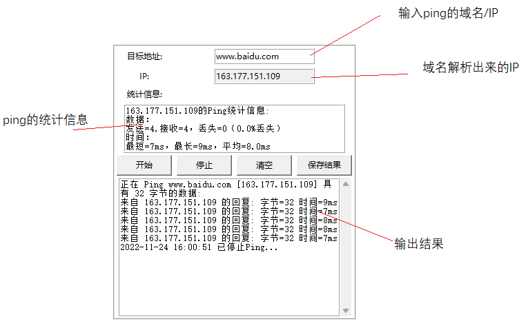

# 网络检测工具
使用python tkinter库开发的一款GUI界面，网络检测工具。 
##### 软件功能：
1、查看本机网络参数信息，支持多网卡。 
2、ping功能，支持多ping，目前仅支持4个。 
3、tracert路由追踪功能。 
4、清除本地NDS缓存。 
5、系统CMD窗口。 
### 软件界面

#### 1、自动获取本地网络参数（本机地址，子网掩码，默认网关，DNS，外网地址）

#### 2、点击【查看所有网络详细信息】，列举出来，本地电脑的所有网卡信息

#### 3、设置ping的参数，默认是ping到手动停止，可以去掉勾选，手动输入次数

#### 4、实用工具，内置【tracert路由追踪】【系统cmd窗口】【清除DNS缓存】三个工具

#### 5、【tracert路由追踪】，Tracert路由跟踪,用于确定IP数据包访问目标所采取的路径。

#### 6、【系统Cmd窗口】，打开本地电脑的cmd窗口

#### 7、【清除DNS缓存】，该工具是刷新本地电脑DNS解析缓存。清除之前，可以用在cmd窗口输入ipconfig /displaydns，来查看DNS缓存记录。

#### 8、Ping，支持多ping，最多支持4个。

### ·链接
[知乎链接](https://www.wdphp.com/)
